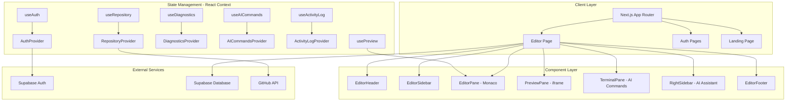
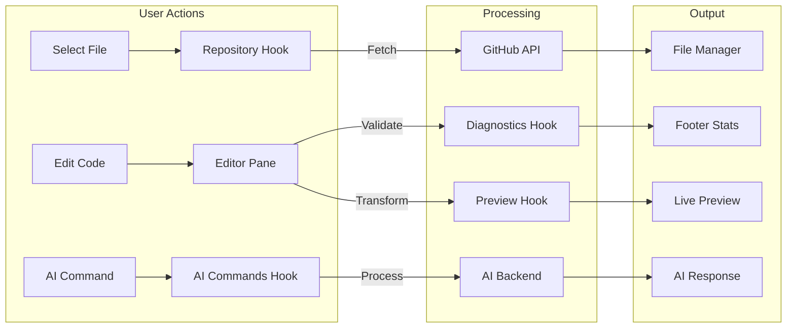
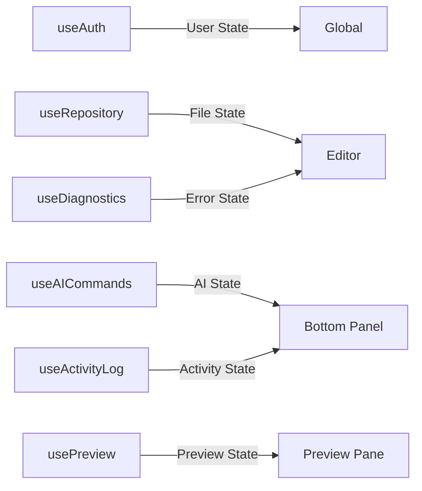
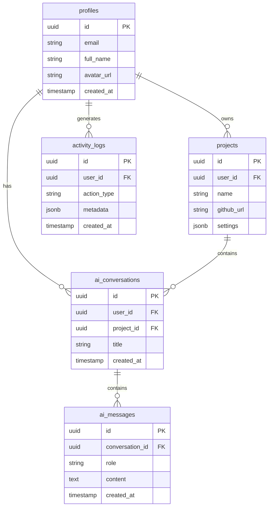
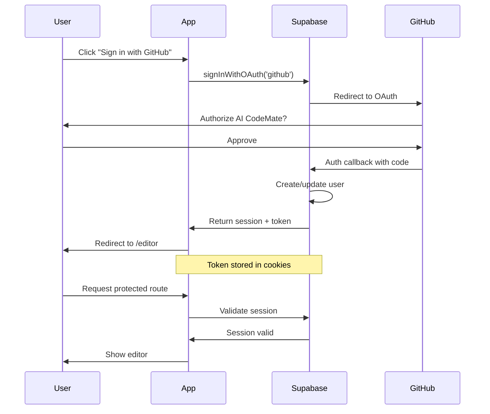

# AI CodeMate - Project Documentation

> Browser-Native AI Development Environment

---

## 📋 Table of Contents

1. [Tech Stack Overview](#tech-stack-overview)
2. [Architecture Diagram](#architecture-diagram)
3. [Project Structure](#project-structure)
4. [Core Features](#core-features)
5. [Component Reference](#component-reference)
6. [Hooks Reference](#hooks-reference)
7. [Database Schema](#database-schema)
8. [API Routes](#api-routes)
9. [Authentication Flow](#authentication-flow)
10. [Future Roadmap](#future-roadmap)

---

## Tech Stack Overview

### Frontend

| Technology        | Version | Purpose                         |
| ----------------- | ------- | ------------------------------- |
| **Next.js**       | 14.2.3  | React framework with App Router |
| **React**         | 18.3.1  | UI library                      |
| **TypeScript**    | 5.4.5   | Type safety                     |
| **Tailwind CSS**  | 3.4.3   | Utility-first styling           |
| **Monaco Editor** | 4.6.0   | VS Code-like code editor        |

### Backend

| Technology       | Version | Purpose                       |
| ---------------- | ------- | ----------------------------- |
| **Supabase**     | 2.89.0  | PostgreSQL database + Auth    |
| **Supabase SSR** | 0.8.0   | Server-side rendering support |
| **bcryptjs**     | 3.0.3   | Password hashing              |
| **Zod**          | 4.2.1   | Schema validation             |

### Developer Experience

| Technology           | Purpose                    |
| -------------------- | -------------------------- |
| **ESLint**           | Code linting               |
| **Tailwind Plugins** | Forms, Typography, Animate |
| **Lucide React**     | Icon library               |
| **Sonner**           | Toast notifications        |

---

## Architecture Diagram



---

## Data Flow Diagram



---

## Project Structure

```
ai-codemate/
├── src/
│   ├── app/                      # Next.js App Router
│   │   ├── api/                  # API routes
│   │   │   └── auth/             # Auth endpoints
│   │   ├── editor/               # Main editor page
│   │   │   └── page.tsx          # Editor entry point
│   │   ├── login/                # Login page
│   │   ├── signup/               # Signup page
│   │   ├── layout.tsx            # Root layout
│   │   ├── page.tsx              # Home/redirect
│   │   ├── providers.tsx         # Global providers
│   │   └── globals.css           # Global styles
│   │
│   ├── components/
│   │   ├── editor/               # Editor components
│   │   │   ├── EditorHeader.tsx  # Top toolbar
│   │   │   ├── EditorSidebar.tsx # File explorer
│   │   │   ├── EditorPane.tsx    # Monaco editor
│   │   │   ├── PreviewPane.tsx   # Live preview
│   │   │   ├── PreviewError.tsx  # Preview errors
│   │   │   ├── TerminalPane.tsx  # AI commands
│   │   │   ├── RightSidebar.tsx  # AI Assistant
│   │   │   ├── EditorFooter.tsx  # Status bar
│   │   │   ├── LandingPage.tsx   # Repo selector
│   │   │   └── GitHubRepoModal.tsx
│   │   ├── marketing/            # Landing page components
│   │   └── ui/                   # Shared UI components
│   │
│   ├── hooks/                    # Custom React hooks
│   │   ├── useAuth.tsx           # Authentication
│   │   ├── useRepository.tsx     # GitHub repo state
│   │   ├── useDiagnostics.tsx    # Code diagnostics
│   │   ├── useAICommands.tsx     # AI command interface
│   │   ├── useActivityLog.tsx    # User activity tracking
│   │   ├── usePreview.tsx        # Live preview logic
│   │   └── useTerminal.tsx       # Terminal emulation
│   │
│   ├── lib/                      # Utilities & configs
│   │   ├── supabase.ts           # Client-side Supabase
│   │   ├── supabase-server.ts    # Server-side Supabase
│   │   ├── auth.ts               # Auth utilities
│   │   ├── github.ts             # GitHub API helpers
│   │   └── utils.ts              # General utilities
│   │
│   ├── middleware.ts             # Route protection
│   ├── types/                    # TypeScript types
│   └── utils/                    # Utility functions
│       └── validators.ts         # Code validators
│
├── supabase-setup.sql            # Database schema
├── tailwind.config.ts            # Tailwind configuration
├── package.json                  # Dependencies
└── tsconfig.json                 # TypeScript config
```

---

## Core Features

### 1. Code Editor (Monaco)

- Syntax highlighting for 50+ languages
- IntelliSense & auto-completion
- Real-time error detection
- Multiple file tabs

### 2. Live Preview System

| File Type | Preview Method          |
| --------- | ----------------------- |
| HTML      | Direct iframe render    |
| CSS       | Styled sample elements  |
| JSON      | Syntax-highlighted tree |
| Markdown  | MD → HTML conversion    |
| SVG       | Direct render           |

**Features:**

- Device simulation (Mobile/Tablet/Desktop)
- Zoom controls (25% - 200%)
- Error overlay with retry
- Auto-refresh on save

### 3. AI Commands Interface

Quick command bar for AI-assisted coding:

| Command     | Action                   |
| ----------- | ------------------------ |
| `help`      | Show available commands  |
| `explain`   | Explain selected code    |
| `refactor`  | Suggest refactoring      |
| `optimize`  | Performance improvements |
| `document`  | Generate documentation   |
| `find bugs` | Detect potential issues  |

### 4. Diagnostics System

- Real-time error/warning counts
- Monaco integration for JS/TS
- Custom validators for Python
- Footer status display

### 5. Collapsible Bottom Panel

- AI Commands tab
- Recent Activity tab
- Click-to-expand from collapsed state
- Smooth animations

---

## Component Reference

### Editor Components

| Component         | Size | Purpose                    |
| ----------------- | ---- | -------------------------- |
| EditorHeader.tsx  | 16KB | Top toolbar with file tabs |
| EditorSidebar.tsx | 6KB  | File tree explorer         |
| EditorPane.tsx    | 9KB  | Monaco editor wrapper      |
| PreviewPane.tsx   | 12KB | Live preview with iframe   |
| TerminalPane.tsx  | 10KB | AI commands & activity     |
| RightSidebar.tsx  | 18KB | AI Assistant panel         |
| EditorFooter.tsx  | 4KB  | Status bar                 |

---

## Hooks Reference

### State Management Hooks



| Hook             | Purpose                | Key Functions                        |
| ---------------- | ---------------------- | ------------------------------------ |
| `useAuth`        | Authentication state   | `signIn`, `signUp`, `signOut`        |
| `useRepository`  | GitHub repo management | `loadRepository`, `selectFile`       |
| `useDiagnostics` | Code error tracking    | `setDiagnostics`, `clearDiagnostics` |
| `useAICommands`  | AI command interface   | `executeCommand`, `navigateHistory`  |
| `useActivityLog` | User activity          | `logActivity`, `getRecentActivities` |
| `usePreview`     | Live preview           | `refresh`, `status`, `error`         |

---

## Database Schema



---

## Authentication Flow



---

## API Routes

| Route                | Method | Purpose                |
| -------------------- | ------ | ---------------------- |
| `/api/auth/callback` | GET    | OAuth callback handler |
| `/api/auth/signout`  | POST   | Sign out user          |

---

## Environment Variables

```bash
# Supabase
NEXT_PUBLIC_SUPABASE_URL=https://xxx.supabase.co
NEXT_PUBLIC_SUPABASE_ANON_KEY=eyJxxx

# GitHub OAuth (via Supabase)
# Configured in Supabase Dashboard

# App
NEXT_PUBLIC_APP_URL=http://localhost:3000
```

---

## Future Roadmap

### Phase 1: AI Integration

- [ ] Connect AI Commands to real LLM API
- [ ] Stream responses in real-time
- [ ] Code generation from prompts

### Phase 2: Collaboration

- [ ] Real-time multi-user editing
- [ ] Cursor presence
- [ ] Chat integration

### Phase 3: Deployment

- [ ] One-click deploy to Vercel/Netlify
- [ ] Environment management
- [ ] CI/CD integration

### Phase 4: Extensions

- [ ] Plugin system
- [ ] Theme marketplace
- [ ] Custom keybindings

---

## Quick Start

```bash
# Clone
git clone <repo-url>
cd ai-codemate

# Install
npm install

# Setup environment
cp .env.example .env.local
# Edit .env.local with your Supabase credentials

# Run database migrations
# Execute supabase-setup.sql in Supabase SQL Editor

# Start development
npm run dev

# Open http://localhost:3000
```

---

## Build & Deploy

```bash
# Production build
npm run build

# Start production server
npm start

# Or deploy to Vercel
vercel --prod
```

---

_Last Updated: January 2026_
